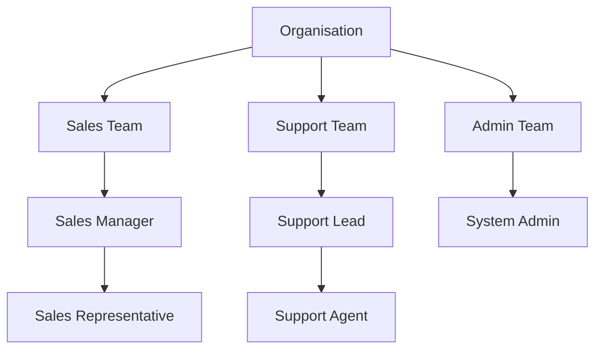
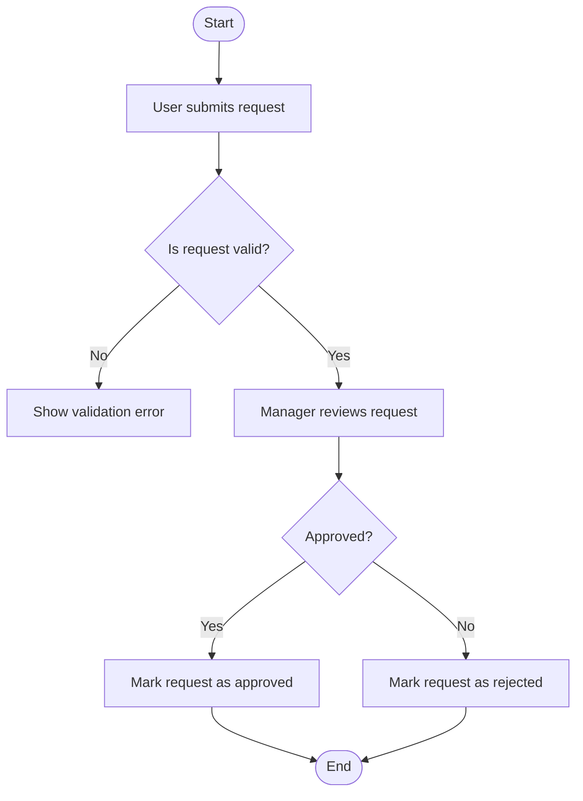
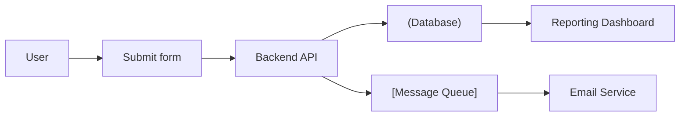
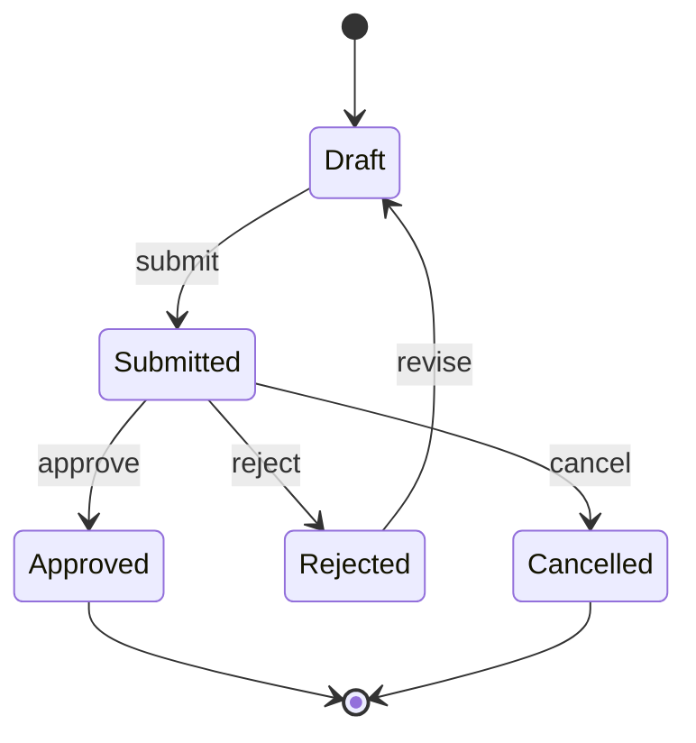
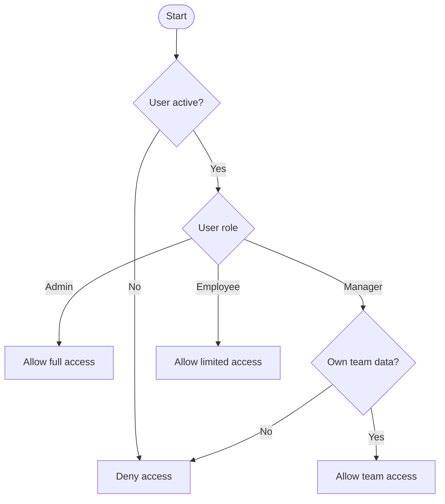

### Visualise 

- object map when:

- there are 3 or more important objects
- relationships are unclear
- cardinality matters
- ownership or containment matters
- teams disagree about object boundaries
- BDD scenarios involve multiple objects

Output format: Mermaid erDiagram or simple object map.

### Visualise as state diagram when:

- an object has 3 or more states
- transitions affect valid/invalid actions
- failure, retry, timeout, cancellation, or pending states exist
- scenarios are state-dependent
- automation needs setup and assertion states

Output format: Mermaid stateDiagram-v2.

### Visualise as action matrix when:

- many actions exist across objects
- action names are inconsistent
- user/system/integration actions are mixed
- permissions or availability depends on state

Output format: compact table or grouped list.

### Visualise as vocabulary map when:

- multiple terms refer to the same concept
- one term means different things in different contexts
- BDD wording is inconsistent
- API/internal terms differ from business terms

Output format: chosen term list or synonym/conflict map.

### Visualise as scenario seed map when:

- the model is stable enough to suggest examples
- states and actions imply clear behavioural rules
- testers need coverage ideas
- automation engineers need reusable step direction

Output format: Given/When/Then seeds, not final scenarios unless requested.

Aim for at least 40% visual output when the input supports it. If diagrams would add noise, say why and keep the capture lightweight.

---

### Visualise as object map when:

- there are 3 or more important objects
- relationships are unclear
- cardinality matters
- ownership or containment matters
- teams disagree about object boundaries
- BDD scenarios involve multiple objects

Output format: Mermaid erDiagram or simple object map.

### Visualise as org chart when:

- hierarchy matters
- reporting lines, ownership, or escalation paths are involved
- roles and responsibilities are unclear
- parent/child relationships exist between teams, users, systems, or components
- permission levels depend on role or position
- workflow handoffs happen between roles or teams
- testers need to validate who can perform, approve, review, or receive something
- BDD scenarios mention managers, admins, customers, agents, approvers, or support teams

Output format: Mermaid flowchart, Mermaid graph, or simple hierarchy tree.

### Visualise as process flow when:

- order of steps matters
- there are decisions, branches, approvals, or handoffs
- multiple actors/systems participate in one workflow
- failures, retries, cancellations, or alternative paths exist
- testers need to identify missing scenarios or edge cases
- automation needs clear setup → action → expected result flow
- BDD scenarios describe a journey from start to finish

Output format: Mermaid flowchart or numbered step flow.

---

### Visualise as Roles and Permissions Matrix when:

- multiple roles can access the same feature, object, or workflow
- permissions differ by action, state, ownership, team, or environment
- scenarios mention admin/user/manager/approver/support/system roles
- access rules are unclear, disputed, or scattered across requirements
- testers need to validate allowed vs denied actions
- negative permission tests are important
- automation needs role-based test data or login setup

Output format: compact table with roles as rows and actions/permissions as columns.

### Visualise as Roles and Permissions Matrix when:

* multiple roles can access the same feature, object, or workflow
* permissions differ by action, state, ownership, team, or environment
* scenarios mention admin/user/manager/approver/support/system roles
* access rules are unclear, disputed, or scattered across requirements
* testers need to validate allowed vs denied actions
* negative permission tests are important
* automation needs role-based test data or login setup

Output format: compact table with roles as rows and actions/permissions as columns.

Example:

| Role     | View request | Create request | Edit own request | Approve request | Delete request |
| -------- | -----------: | -------------: | ---------------: | --------------: | -------------: |
| Employee |          Yes |            Yes |              Yes |              No |             No |
| Manager  |          Yes |             No |               No |             Yes |             No |
| Admin    |          Yes |            Yes |              Yes |             Yes |            Yes |
| Support  |          Yes |             No |               No |              No |             No |

### Visualise as Decision Table when:

- multiple conditions combine to produce different outcomes
- business rules include yes/no, true/false, threshold, or eligibility logic
- testers need clear positive, negative, and edge-case coverage

Output format: compact decision table with conditions, actions/outcomes, and rule columns.

Example:

| Condition / Outcome | Rule 1 | Rule 2 | Rule 3 |
| ------------------- | -----: | -----: | -----: |
| User is active      |    Yes |    Yes |     No |
| Payment is valid    |    Yes |     No |    Yes |
| Allow purchase      |    Yes |     No |     No |
| Show error          |     No |    Yes |    Yes |

### Visualise as Data Flow Diagram when:

- data moves between users, systems, APIs, databases, files, or queues
- inputs, outputs, transformations, or storage points are unclear
- testers need to validate integration points, missing data, or data loss risks

Output format: Mermaid flowchart showing sources, processes, stores, and destinations.

### Visualise as Data Dictionary when:

- fields, attributes, or payload properties need clear definitions
- data type, format, required/optional rules, or allowed values matter
- testers need to validate input rules, API contracts, mappings, or test data

Output format: compact table with field name, meaning, type, rules, and example value.

Example:

| Field      | Meaning                      | Type     | Rules                           | Example                |
| ---------- | ---------------------------- | -------- | ------------------------------- | ---------------------- |
| customerId | Unique customer identifier   | String   | Required, UUID format           | `7f3a9c2e-1234`        |
| email      | Customer email address       | String   | Required, valid email format    | `user@example.com`     |
| status     | Customer account status      | Enum     | `Active`, `Suspended`, `Closed` | `Active`               |
| createdAt  | Date/time record was created | DateTime | System-generated, ISO 8601      | `2026-06-23T10:15:00Z` |

### Visualise as State Diagram when:

- an object or workflow has 3 or more meaningful states
- allowed actions depend on the current state
- failure, retry, timeout, cancellation, approval, or pending states exist

Output format: Mermaid stateDiagram-v2.

### Visualise as Decision Tree when:

- choices are made in sequence and each choice changes the next path
- rules depend on branching conditions, thresholds, or eligibility checks
- testers need to identify all possible paths, outcomes, and missing branches

Output format: Mermaid flowchart with decision nodes and outcome leaves.

Example:

